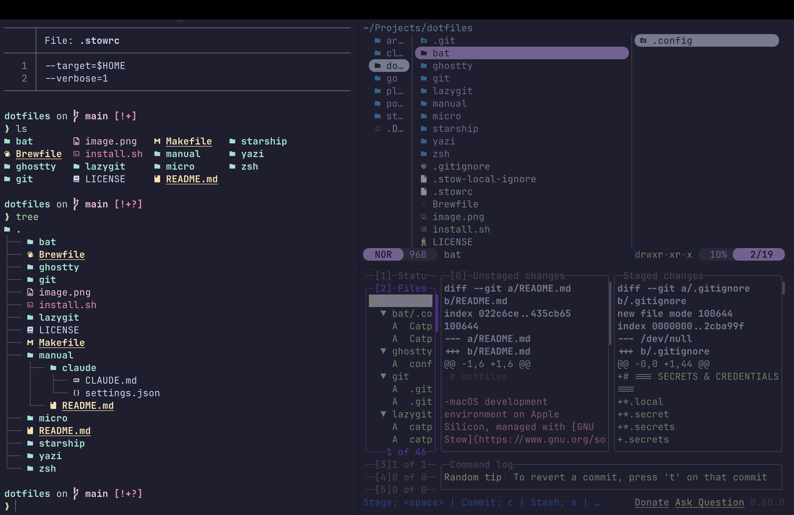
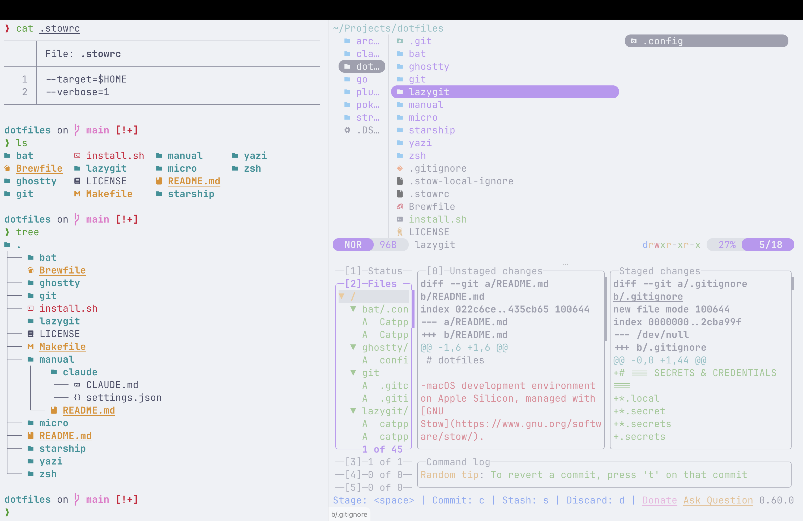

# dotfiles

[](https://catppuccin.com)

My dotfiles with Catppuccin theme.




## What's inside

- **Shell**: zsh + Oh-My-Zsh + Starship prompt
- **Terminal**: Ghostty
- **Editor**: micro
- **CLI**: bat, eza, fzf, ripgrep, fd, zoxide, yazi, lazygit, lazydocker
- **Theme**: Catppuccin (auto light/dark switching)
- **Font**: JetBrains Mono Nerd Font
- **Packages**: Brewfile for Homebrew

## Quick start

```bash
git clone https://github.com/zulerne/dotfiles-public.git ~/.dotfiles
cd ~/.dotfiles
./install.sh  # installs Oh-My-Zsh, zsh plugins, and stows all configs
```

To stow selectively: `stow zsh starship ghostty`
To preview changes: `stow -n -v zsh`
To remove symlinks: `stow -D zsh`

## Structure

Each directory is a Stow package. Contents mirror paths from `$HOME`.

```
zsh/.zshrc                              → ~/.zshrc
zsh/.zprofile                           → ~/.zprofile
zsh/.zsh/catppuccin-apply.zsh           → ~/.zsh/catppuccin-apply.zsh
starship/.config/starship.toml          → ~/.config/starship.toml
ghostty/.config/ghostty/config          → ~/.config/ghostty/config
micro/.config/micro/settings.json       → ~/.config/micro/settings.json
bat/.config/bat/themes/                 → ~/.config/bat/themes/
lazygit/.config/lazygit/                → ~/.config/lazygit/
yazi/.config/yazi/                      → ~/.config/yazi/
git/.gitconfig                          → ~/.gitconfig
git/.gitignore_global                   → ~/.gitignore_global
```

`manual/` — configs that are copied manually, not managed by stow (e.g. Claude Code).

## Personalization

Machine-specific secrets go in local override files (gitignored):

- `~/.zshrc.local` — API keys, tokens, private env vars
- `~/.gitconfig.local` — name, email, signing key

## Shell aliases

Standard commands are replaced with modern alternatives:

| Command | Replacement |
|---------|-------------|
| `cat`   | bat         |
| `ls`    | eza         |
| `grep`  | ripgrep     |
| `cd`    | zoxide      |
| `find`  | fd          |
| `http`  | xh          |

## Notes

Configs are tailored for macOS (Apple Silicon). On Linux you'll need to adjust:

- `zsh/.zprofile` — Homebrew path (`/opt/homebrew/...` → `/home/linuxbrew/...`)
- `zsh/.zshrc` — remove `macos` from Oh-My-Zsh plugins
- `zsh/.zsh/catppuccin-apply.zsh` — replace `defaults read` with your DE's dark mode detection
- `ghostty/config` — remove `macos-option-as-alt`
